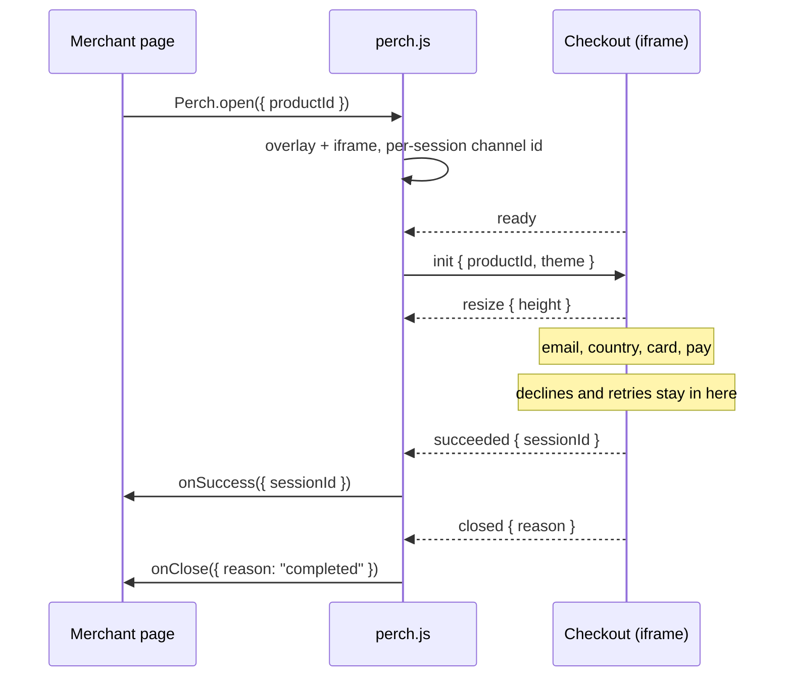

# Perch

An embeddable checkout you'd be comfortable putting on a stranger's website.

A merchant adds one script tag and calls one function. A checkout opens over their
page, the customer pays without leaving it, and the card details never touch it.

| | |
|---|---|
| **Demo store** | _deploy pending — see [Deploying](#deploying)_ |
| **Checkout** | _deploy pending_ |
| **Source** | https://github.com/Shanmugamrskfamily/perch-checkout |

---

## The integration, in full

```html
<script src="https://checkout.example/perch.js"></script>
<script>
  Perch.open({
    productId: "prod_notebook",
    onSuccess: ({ sessionId }) => {},
    onClose:   ({ reason })    => {},
    onError:   ({ code, message }) => {},
  });
</script>
```

That is the entire public surface: one function, one handle, three callbacks.
`DodoCheckout` is installed as an alias so the snippet in the brief works verbatim.

`open()` returns a handle with `close()` and `isOpen`. Calling it again while a
checkout is open returns the handle to the existing one rather than opening a
second.

### Callback guarantees

- `onClose` fires **exactly once**, and **always last**. A merchant can re-enable
  their Buy button there without tracking which other callback ran.
- `onSuccess` fires at most once, before `onClose`.
- `onError` fires at most once, before `onClose`, and only for terminal failures.
- Nothing fires synchronously from `open()`, so `const h = Perch.open(…)` is
  always assigned before any callback can reference it.

---

## Try it

Any future expiry and any security code will do.

| Card | What happens |
|---|---|
| `4242 4242 4242 4242` | Approved first time |
| `4000 0000 0000 0002` | Declined by the issuer. Retrying will not help |
| `4000 0000 0000 0341` | Connection drops on the first attempt, completes on retry |

Every other card number is declined. The demo store lists these on the page, one
tap to copy, so a reviewer can reach every state without reading this first.

Other things worth trying: leave the checkout open for three minutes to watch it
expire, press Escape, tab past the last field, and open it on a phone-width
window.

---

## Running it locally

```bash
npm install
npm run dev
```

Three things start: the embed script in watch mode, the checkout on port 3001,
and the demo store on port 3000. Open http://localhost:3000.

The ports differ because **the origins must differ**. If both shipped from one
origin the isolation described below would be decorative rather than real.

```bash
npm test          # 143 tests
npm run typecheck # all four workspaces
npm run lint
npm run build     # embed script, then both apps
```

---

## How the pieces talk

```
apps/demo          the merchant's site        localhost:3000
apps/checkout      the checkout, in an iframe localhost:3001
packages/sdk       perch.js, zero deps        served from the checkout's origin
packages/protocol  the wire contract          compiled by both sides
```

The script is served from the **checkout's** origin, not the merchant's. That is
deliberate: it lets the script work out where the checkout lives from its own
`<script>` tag, so there is no origin for a merchant to configure, mistype, or
point somewhere else.



### The messages

Everything travels in one envelope carrying the protocol name, a version, and a
per-session random channel id. Both sides drop anything that fails to parse.

| Direction | Message | Meaning |
|---|---|---|
| host → frame | `init` | Here is what to charge for. Accepted once only |
| host → frame | `requestClose` | The customer wants out. The frame decides what that means |
| host → frame | `focus` | Focus tabbed out; take it back at this end |
| frame → host | `ready` | Mounted, waiting for `init` |
| frame → host | `resize` | My content is this tall |
| frame → host | `succeeded` | Paid, with a session id |
| frame → host | `failed` | Terminal failure, with a code |
| frame → host | `closed` | Finished, with a reason |

Notably **absent**: anything about the email, the card, how many times the
customer tried, or why a card was declined.

---

## Security

### Why an iframe

The browser's same-origin policy means a document from the merchant's origin
cannot read the DOM of a document from the checkout's. Not "should not" — cannot.
So the card input lives in a cross-origin iframe, and the merchant's JavaScript
is physically unable to read the keystrokes even if the merchant is hostile. The
customer sees one page; there are two documents, and `postMessage` is the only
channel between them.

### What the host page can still do

Stating this plainly matters more than a longer list of things we defend against.
The host owns the page around the iframe. It can remove it, cover it, or lie to
its own customer about what it is. **You cannot defend a page from itself.** What
is defended is the card data, and the boundary against *other* origins.

### Who may embed the checkout

Two layers, doing different jobs:

- `frame-ancestors` in the Content Security Policy. The browser refuses to render
  the checkout inside a page that is not on the list. This is the enforcement.
- An in-page check that compares the origin the SDK claims in the URL against the
  referrer the browser sets, which a framing page cannot forge. This produces an
  explanation a human can read, and covers the case where a merchant's registered
  domains and their actual deployment have drifted apart.

Every refusal returns the same message, because telling an attacker which check
they failed is free help.

Verified against a phishing simulation served from a third origin: the frame
renders empty and its location is inaccessible from the embedding page.

### `onSuccess` is not proof of payment

The most important line in this document.

`onSuccess` runs in the customer's browser. Anyone can open a console and call it.
A shop that ships goods on that callback can be robbed by its own customers.

In production, fulfilment happens server-side, when the payment provider calls the
merchant's server with a **signed webhook** the browser cannot forge. The callback
here is a user-interface signal and nothing more. The demo store's source says so
where a real integration would be tempted to get it wrong.

### The rest

- Nonce-based CSP on the checkout document, so no inline script we did not put
  there can run. `object-src`, `base-uri` and `form-action` are locked down: a
  payment form that can be made to submit to another origin is the whole attack.
- The overlay lives in a shadow root, so the merchant's CSS cannot reach it and
  ours cannot leak into their page. It is **open**, not closed: there is nothing
  secret in that tree, and closed mode mainly prevents debugging on the very
  websites where debugging is needed.
- The global is installed non-writable, so a later script cannot swap `Perch.open`
  for a look-alike that collects card numbers on the host page.
- The theme is an allowlist of two properties, re-validated on the frame side
  rather than trusted from the SDK. Colours must be plain six-digit hex: an accent
  is interpolated into a stylesheet, and CSS is a language.
- Everything on the page is marked `inert` while the checkout is open.
- DOM is built with `textContent`, never `innerHTML`.
- No card number is ever logged. The modules that hold one contain no logging at
  all, which is the cheapest way to guarantee it.

---

## The open questions, and what I decided

The brief left these deliberately unanswered.

**How much a site can change about the checkout.** Almost nothing: an accent
colour and a corner radius, from a fixed set. A merchant who can restyle a payment
form freely can make it look like something it is not, and the customer's only
defence is that it looks the same everywhere they meet it. Unsupported options are
dropped, not rejected, so a typo still yields a working checkout — and the console
names exactly what was ignored, because silence would leave a merchant wondering
why their theme did nothing.

**What the customer sees when a payment fails halfway.** It depends which kind of
"fails", and conflating the two is the common mistake. A **decline** is a decision:
the money definitely did not move, and the copy says which bank refused it. A
**lost connection** is an unknown: we cannot say whether the charge went through,
so the checkout says exactly that, keeps every field, and retries under the same
idempotency key so finding out cannot become a second charge.

**What happens if someone hits Buy twice.** Nothing visible, at three layers. The
SDK returns the existing handle instead of opening a second checkout. The reducer
has no transition for a submit while a charge is in flight, so a double submit is
unrepresentable rather than handled. The gateway coalesces two requests sharing an
idempotency key into one charge. The disabled button is how the customer sees
this; the other two are what make it true.

**What the host page should and shouldn't know.** Outcomes, not detail. It learns
that a payment succeeded, that a terminal error occurred, and that the window
closed. It does not learn the email, the card, the decline reason, or how many
attempts it took. Merchants genuinely do want that information — and they get it
server-side from the webhook, where it is both trustworthy and actionable, rather
than in the browser where it is neither.

---

## Two decisions I went back and forth on

### 1. Whether the merchant should be told about declines

The first version reported declines to `onError`. It is obviously useful: a
merchant who knows a customer's card was refused can send a recovery email, and
every abandoned checkout is money they nearly had.

I took it out. A decline is recoverable *inside* the checkout — the customer tries
another card and carries on — so surfacing it hands the merchant's page a fact
about someone's finances at a moment when it cannot act on it usefully anyway.
Worse, a browser callback is the wrong channel for it: unauthenticated, forgeable,
and delivered only if the customer's tab stays open.

What settled it was noticing the two things want opposite guarantees. Recovery
email wants durable, server-confirmed, *eventually* delivered. The callback is
none of those. So declines go where that information already has to go for the
webhook, and the client surface stays honest about what it can actually promise.

I am still not certain. The counter-argument is that merchants will ask for it,
and refusing a reasonable request on principle is how you get a reputation for
being difficult to integrate with.

### 2. Whether to ask for the customer's country at all

The product thesis is fewer steps and nothing in the way. Adding a required field
to a four-field form is exactly what that thesis tells you not to do, and I built
it without one first.

Then the Merchant of Record model made it unavoidable. Being the merchant of
record means being the legal seller, so the tax owed is decided by where the
*customer* is, not where the shop is. Without that field there is no honest total
to show — only a subtotal that would change after the customer committed to it.

So the field went in, and the ordering became the real decision: it sits **above**
the card fields, because choosing it moves the total, and nobody should type a
card number against a figure that is about to change. The Pay button says
"Continue" until there is a final amount it can honestly quote.

The residual doubt is whether it should be a field at all rather than a guess from
the network, with the customer correcting it only if it is wrong. That would be
better, and it needs a geolocation service this does not have.

---

## What I'd explore next

Roughly in the order I would actually do them.

- **A real server, and webhooks.** The single biggest gap. Everything here is
  client-side by the brief's design, which means the most important part of a
  payment system — the signed, server-to-server confirmation — is described in
  this document rather than built. Idempotency keys are only truly meaningful
  once there is a server honouring them.
- **Additional factor authentication.** India's regulator requires it on most card
  payments, and 3-D Secure is the equivalent elsewhere. It changes the flow shape
  significantly: the checkout has to hand off, wait, and come back, which adds two
  states and a whole category of "the customer never came back" to handle.
- **Presentment currency with quoted rates.** The approximate figure shown to a
  customer abroad uses constants and says so. Real cross-border checkout quotes a
  rate with an expiry and charges in the customer's currency.
- **Per-merchant domain registration** replacing the environment-variable
  allowlist, so `frame-ancestors` is derived from what each merchant registered
  during onboarding rather than a deploy-time list.
- **Wallets.** UPI in India, Apple Pay and Google Pay elsewhere. For a lot of
  customers these are the difference between paying and abandoning, and they
  mostly remove the card form rather than adding to it.
- **A browser-level test of the cross-origin flow.** The message contract and the
  state machine are covered by unit tests, but the handshake itself is verified by
  hand. Playwright can drive two origins and would close that gap.
- **Copy in more than English**, and a serious look at what the decline messages
  should say when the issuer gives a specific reason.

---

## Testing

```bash
npm test
```

143 tests across three projects. They are written against pure functions rather
than the DOM on purpose: a guarantee that only holds because a button happened to
be disabled is not a guarantee, it is a coincidence that survives until someone
restyles the button.

| Project | What it proves |
|---|---|
| `protocol` | Everything crossing the frame boundary. Junk, wrong channels, stale versions, forged error codes, implausible frame heights and CSS injection through the theme are all dropped in silence |
| `sdk` | The public surface: callbacks never fire synchronously, `onClose` always fires, a merchant callback that throws cannot break teardown, two Buy clicks open one checkout, the global cannot be replaced |
| `checkout` | The double-charge guarantee at both layers, that a retry keeps its idempotency key and a card change gets a new one, that a decline keeps every field, the origin allowlist including lookalikes a `startsWith` check would wave through, and money staying integral |

---

## Deploying

Two Vercel projects from one repository, because the origins must differ.

| Project | Root directory | Environment variable |
|---|---|---|
| checkout | `apps/checkout` | `NEXT_PUBLIC_ALLOWED_HOST_ORIGINS` = the demo store's URL |
| demo | `apps/demo` | `NEXT_PUBLIC_CHECKOUT_ORIGIN` = the checkout's URL |

Each references the other, so deploy both once, set the two variables, then
redeploy. The checkout's build compiles `perch.js` into its own `public/`
directory before Next runs, so the script ships from the checkout's origin.

---

## Shortcuts, stated plainly

- There is no server. The gateway is a module that models the *shape* of the
  problem — succeed, decline, or never answer — rather than the cryptography.
- Tax rates are one headline number per country. Real tax is jurisdictional and
  is somebody's full-time job.
- The exchange rates behind the indicative local figure are constants.
- The session window is three minutes so the expiry state is reachable by someone
  reviewing this. Production would measure how long people take and set it well
  above the slowest of them.
- The origin allowlist is an environment variable standing in for a database.
